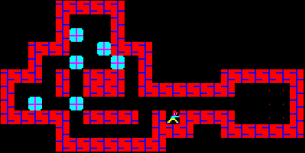

# Sokoban pathfinding
In this optional assignment you will implement a building block to use in the Sokoban project. This is an individual assignment and a self-test of your basic programming skills. Unless you find the task simple you should reconsider the choice of course or brush up on the programming and algorithmic skills that are prerequisites of this course.

A sokoban map is a two-dimensional grid that contains walls, boxes, goals and one player, as seen in the figure /reffig:ex. The target of the game is to push the boxes onto the goals. In this assignment, however, your target is simpler. You just need to move the player to any goal WITHOUT pushing any boxes.

  

Figure 1: A graphical illustration of a sokoban map. There is one player, N boxes and goals. In this assignment the task is to find a path from the start position of the player to one of the goals WITHOUT moving any boxes.

### Reference
https://kth.kattis.com/problems/kth.ai.sokobanpathfinding
